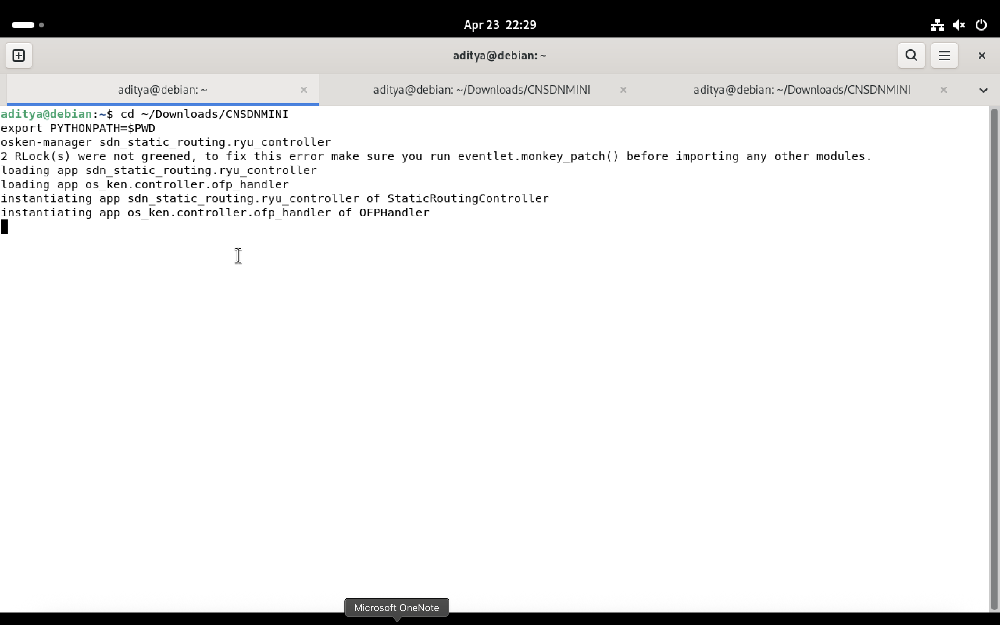
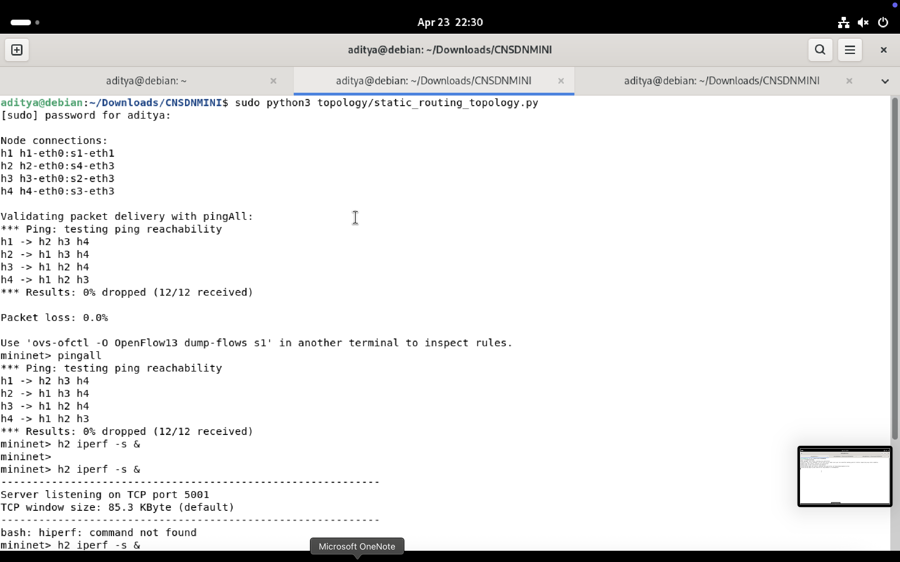
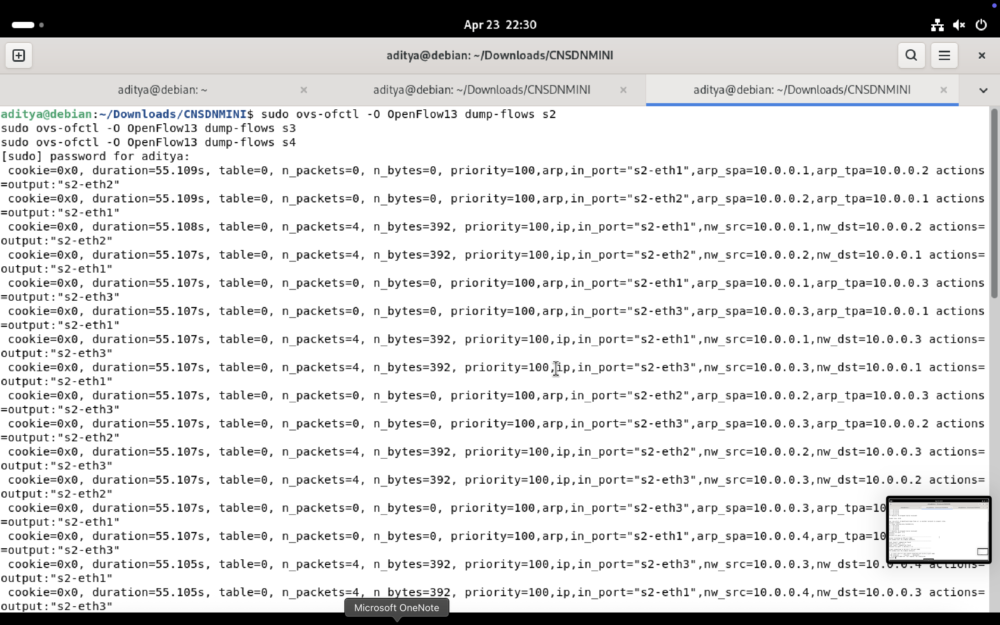
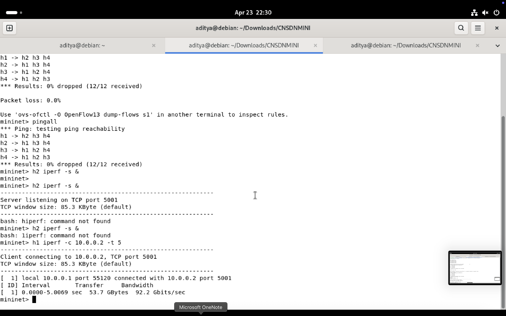

# Static Routing Using an SDN Controller

This project implements fixed host-to-host routing paths using controller-installed OpenFlow rules. A Ryu controller installs ARP and IPv4 forwarding rules on four Open vSwitch switches, and a Mininet topology validates packet delivery.

## Project Goal

Implement static routing paths using an SDN controller:

- Define routing paths.
- Install flow rules manually from the controller.
- Validate packet delivery.
- Document routing behavior.
- Add a regression test to ensure the selected path remains unchanged after rule reinstall.
 ## Screenshots

### Network Topology & Ryu Controller


### Connectivity Validation (Pingall)


### Flow Rules & Performance




## Topology

```text
          h3
          |
h1 -- s1 -- s2 -- s4 -- h2
      |           |
      s3 --------+
      |
      h4
```

Switch and host placement:

| Host | IP | MAC | Attached switch port |
| --- | --- | --- | --- |
| h1 | 10.0.0.1 | 00:00:00:00:00:01 | s1-eth1 |
| h2 | 10.0.0.2 | 00:00:00:00:00:02 | s4-eth3 |
| h3 | 10.0.0.3 | 00:00:00:00:00:03 | s2-eth3 |
| h4 | 10.0.0.4 | 00:00:00:00:00:04 | s3-eth3 |

## Static Routes

| Traffic | Static switch path |
| --- | --- |
| h1 <-> h2 | s1 -> s2 -> s4 |
| h1 <-> h3 | s1 -> s2 |
| h1 <-> h4 | s1 -> s3 |
| h2 <-> h3 | s4 -> s2 |
| h2 <-> h4 | s4 -> s3 |
| h3 <-> h4 | s2 -> s1 -> s3 |

The path from `h1` to `h2` deliberately uses `s1 -> s2 -> s4`. The alternate physical route `s1 -> s3 -> s4` exists but is not selected, proving that the controller controls forwarding behavior.

## Files

| File | Purpose |
| --- | --- |
| `sdn_static_routing/static_paths.py` | Source of truth for hosts, link ports, static routes, and generated flow rules. |
| `sdn_static_routing/ryu_controller.py` | Ryu OpenFlow 1.3 controller that installs static flow rules. |
| `topology/static_routing_topology.py` | Mininet topology used for packet delivery validation. |
| `tests/test_static_paths.py` | Regression tests for route stability and generated flow ports. |
| `PROJECT_REPORT.md` | Submission-ready explanation of design, behavior, and testing. |

## How to Run

Install dependencies in a Linux VM with Mininet and Open vSwitch:

```bash
pip3 install ryu
sudo apt install mininet openvswitch-switch
```

Start the controller in terminal 1:

```bash
ryu-manager sdn_static_routing.ryu_controller
```

Start the topology in terminal 2:

```bash
sudo python3 topology/static_routing_topology.py
```

Inside the Mininet CLI, validate delivery:

```bash
pingall
h1 ping -c 3 h2
```

Inspect installed rules:

```bash
sudo ovs-ofctl -O OpenFlow13 dump-flows s1
sudo ovs-ofctl -O OpenFlow13 dump-flows s2
sudo ovs-ofctl -O OpenFlow13 dump-flows s4
```

Expected `h1 -> h2` forwarding:

- `s1`: input port 1, output port 2
- `s2`: input port 1, output port 2
- `s4`: input port 1, output port 3

## Regression Test

Run without Ryu or Mininet:

```bash
python3 -m unittest discover -s tests
```

The test `test_h1_to_h2_path_is_regression_locked` fails if the required `h1 -> h2` path changes from `s1 -> s2 -> s4`.

